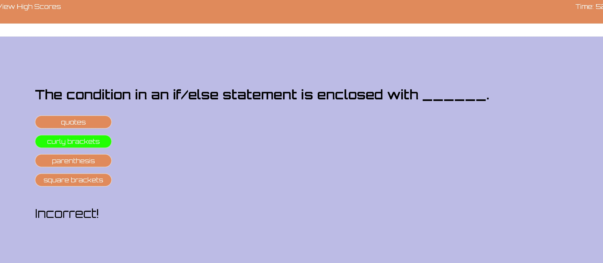

# Coding-Quiz

## Description

The project provides individuals with a timed JavaScript quiz in the Web APIs Code Quiz Challenge. The quiz includes questions related to Web APIs and JavaScript concepts. Participants can test their knowledge and improve their skills in a fun and interactive way.

Images:

## Table of Contents

💠[Installation](#installation)
💠[Usage](#usage)
💠[License](#license)
💠[Contribution](#contribution)
💠[Test](#test)
💠[Credits](#credits)
💠[Questions](#questions)
💠[Deployed](#deployed)

## Installation

Just download the directory or make a copy of it. Once you've downloaded or copied the directory, you can start looking through its files and making any changes you need. It is best to keep the directory up-to-date so that you always have the most recent version of the files.

## Usage

As a coding boot camp student, I want a JavaScript fundamentals timed quiz with high marks to compare my progress to my peers.
Given my code test, I'm asked a question and a timer starts when I press start. After answering a question, I get another. Time is deducted when I answer a question incorrectly. I can save my initials and score when all questions are answered or the timer reaches 0.

## License

    This project is licensed under the None license.

## Contribution

Submit a pull request for review when contributing to the code. Any changes to the code should be fully tested and noted in the README.md file.

## Test

To test the coding quiz simply by either downloading the zip file or clone the repo.

## Credits

Special thanks to : Instructor, Classmates, and TAs in the UC Berkeley bootcamp. Their guidance and support have been invaluable in helping me develop my skills and achieve my goals in this program. I am grateful for the opportunity to learn from such a talented and dedicated group of individuals. Resources: https://www.w3schools.com/

## Questions

✉ For any questions, please contact karimiabdolkarim0@gmail.com.
💻You can also find my GitHub profile at:>[mackarimi] (https://github.com/mackarimi/).

## Deployed

This project is deployed at [https://github.com/mackarimi/Web-APIs-Challenge-Code-Quiz/tree/main].
Click for Webpage: https://mackarimi.github.io/Web-APIs-Challenge-Code-Quiz/
